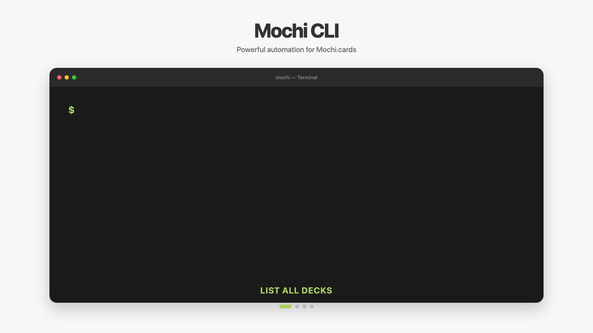

# Mochi CLI

A powerful command-line interface for [Mochi.cards](https://mochi.cards) - manage flashcards, decks, and templates from the command line. Built for LLMs and automation workflows.



## Features

- **Complete API Coverage** - Full implementation of the Mochi.cards API
- **Multiple Output Formats** - JSON (default, LLM-friendly), Table, Compact, Markdown
- **Multi-Profile Support** - Store multiple API keys and switch between them
- **Self-Updating** - Built-in `upgrade` command to stay current
- **Pipe-Friendly** - Read from stdin, write to stdout - perfect for scripting
- **Shell Completions** - Tab completion for Bash, Zsh, Fish, PowerShell
- **Dry-Run Mode** - Preview changes before executing
- **LLM/Script Optimized** - Quiet mode, JSON errors, field extraction

## Quick Start

### Installation

#### One-Line Install (macOS/Linux)

```bash
curl -fsSL https://raw.githubusercontent.com/nerveband/mochi-cli/main/install.sh | bash
```

#### Download Pre-compiled Binaries

**macOS (Apple Silicon)**
```bash
curl -L https://github.com/nerveband/mochi-cli/releases/latest/download/mochi-cli_Darwin_arm64.tar.gz | tar xz
sudo mv mochi /usr/local/bin/
```

**macOS (Intel)**
```bash
curl -L https://github.com/nerveband/mochi-cli/releases/latest/download/mochi-cli_Darwin_x86_64.tar.gz | tar xz
sudo mv mochi /usr/local/bin/
```

**Linux (x64)**
```bash
curl -L https://github.com/nerveband/mochi-cli/releases/latest/download/mochi-cli_Linux_x86_64.tar.gz | tar xz
sudo mv mochi /usr/local/bin/
```

**Windows (x64)**
Download `mochi-cli_Windows_x86_64.zip` from [releases](https://github.com/nerveband/mochi-cli/releases) and add to PATH.

#### Build from Source

```bash
git clone https://github.com/nerveband/mochi-cli.git
cd mochi-cli
go build -o mochi .
```

### First-Time Setup

```bash
# Add your API key as a profile
mochi config add my-profile YOUR_API_KEY

# The first profile becomes active automatically
# Verify it's working
mochi deck list
```

**Get your API key:** In Mochi, go to Account Settings → API Keys to create one.

## Usage

### Configuration Management

```bash
# Add profiles (first becomes active)
mochi config add work API_KEY_1
mochi config add personal API_KEY_2

# List profiles (* = active)
mochi config list

# Switch active profile
mochi config use personal

# Remove a profile
mochi config remove work
```

### Deck Operations

```bash
# List all decks
mochi deck list

# Get a specific deck
mochi deck get DECK_ID

# Create a new deck
mochi deck create "My New Deck"
mochi deck create "Nested Deck" --parent PARENT_DECK_ID

# Update a deck
mochi deck update DECK_ID --name "New Name"
mochi deck update DECK_ID --archive

# Delete a deck (with confirmation)
mochi deck delete DECK_ID
mochi deck delete DECK_ID --force  # Skip confirmation
```

### Card Operations

```bash
# List cards
mochi card list
mochi card list --deck DECK_ID
mochi card list --limit 50

# Get a specific card
mochi card get CARD_ID

# Create a card
mochi card create --deck DECK_ID --content "# Question\n\nAnswer here"
mochi card create --deck DECK_ID --file card.md

# Create from stdin
echo "# Card Content" | mochi card create --deck DECK_ID --stdin

# Update a card
mochi card update CARD_ID --content "New content"
mochi card update CARD_ID --name "New Name"
mochi card update CARD_ID --archive

# Delete a card
mochi card delete CARD_ID
mochi card delete CARD_ID --force

# Search cards (client-side)
mochi card search "keyword"
mochi card search "keyword" --deck DECK_ID
```

### Template Operations

```bash
# List templates
mochi template list

# Get a template
mochi template get TEMPLATE_ID
```

### Due Cards

```bash
# List cards due today
mochi due list

# List cards due on specific date
mochi due list --date 2024-12-25

# Count due cards
mochi due count

# For specific deck
mochi due list --deck DECK_ID
```

### Attachments

```bash
# Add attachment to card
mochi attachment add CARD_ID /path/to/file.png

# Delete attachment
mochi attachment delete CARD_ID filename.png
```

## Output Formats

### JSON (Default - LLM/Script Friendly)

```bash
mochi deck list --format json
# Returns: {"decks": [...], "bookmark": "..."}
```

### Table (Human Readable)

```bash
mochi deck list --format table
# ID               NAME              SORT   ARCHIVED
# ABCD1234         My Deck           1      
```

### Compact (Flat Array)

```bash
mochi deck list --format compact
# [{"id":"...","name":"..."},...]
```

### Markdown

```bash
mochi card get CARD_ID --format markdown
# Returns formatted markdown suitable for documentation
```

## LLM & Scripting Features

### Quiet Mode

Suppress all non-essential output:

```bash
mochi deck list --quiet
# Only outputs the data, no status messages
```

### Extract Specific Fields

```bash
# Get only IDs
mochi deck list --id-only
mochi deck list --output-only id

# Extract any field
mochi card get CARD_ID --output-only content
```

### Pipe-Friendly

```bash
# Create cards from files
cat card.md | mochi card create --deck DECK_ID --stdin

# Process cards with jq
mochi card list --quiet | jq '.cards[].id'

# Export all cards
for id in $(mochi card list --deck DECK_ID --id-only --quiet); do
  mochi card get $id --format json > "cards/${id}.json"
done
```

### JSON Errors

```bash
mochi card get INVALID_ID --json-errors
# {"error": "card not found"}
```

### Dry-Run Mode

Preview changes without executing:

```bash
mochi card create --deck DECK_ID --content "Test" --dry-run
# Dry run - would create card:
#   Deck: DECK_ID
#   Content: Test
```

## Configuration

Config file: `~/.mochi-cli/config.json`

### Config Precedence

1. CLI flags (`--api-key`)
2. Environment variable (`MOCHI_API_KEY`)
3. Profile in config file
4. Error if none found

### Environment Variables

```bash
export MOCHI_API_KEY="your-api-key"
mochi deck list  # Uses env var
```

### Security

- API keys are stored in plain text in `~/.mochi-cli/config.json`
- Set file permissions: `chmod 600 ~/.mochi-cli/config.json`
- Never commit config files to version control
- Use environment variables for CI/CD

## Shell Completions

### Bash

```bash
mochi completion bash > /etc/bash_completion.d/mochi
# Or on macOS with Homebrew:
mochi completion bash > $(brew --prefix)/etc/bash_completion.d/mochi
```

### Zsh

```bash
mochi completion zsh > "${fpath[1]}/_mochi"
```

### Fish

```bash
mochi completion fish > ~/.config/fish/completions/mochi.fish
```

### PowerShell

```powershell
mochi completion powershell > mochi.ps1
# Source from your profile
```

## Self-Update

```bash
# Check for updates
mochi upgrade --check

# Install latest version
mochi upgrade

# Check current version
mochi version
```

## Exit Codes

| Code | Meaning |
|------|---------|
| 0 | Success |
| 1 | User error (invalid input, missing args) |
| 2 | API error (network, auth, rate limit) |
| 3 | Config error |

## Error Categories (with `--json-errors`)

- `AUTH_ERROR` - Invalid or missing API key
- `NOT_FOUND` - Resource not found
- `RATE_LIMIT` - Too many requests
- `API_ERROR` - Server-side error
- `CONFIG_ERROR` - Configuration issue

## API Reference

This CLI implements the full Mochi.cards API:

- **Cards** - Create, read, update, delete, search, attachments
- **Decks** - Create, read, update, delete, nested hierarchies
- **Templates** - List, get
- **Due** - Query cards due for review

See [Mochi API Docs](https://mochi.cards/docs/api/) for more details.

## Development

### Project Structure

```
mochi-cli/
├── cmd/                    # CLI commands
│   ├── root.go            # Root command & global flags
│   ├── config.go          # Profile management
│   ├── card.go            # Card operations
│   ├── deck.go            # Deck operations
│   ├── template.go        # Template operations
│   ├── due.go             # Due cards
│   ├── attachment.go      # Attachment operations
│   ├── version.go         # Version info
│   ├── upgrade.go         # Self-update
│   ├── completion.go      # Shell completions
│   ├── output.go          # Output formatting
│   └── helper.go          # Utility functions
├── internal/
│   ├── api/client.go      # Mochi API client
│   ├── config/config.go   # Configuration management
│   └── models/models.go   # Data structures
├── main.go                # Entry point
├── install.sh             # One-line installer
├── .goreleaser.yml        # Release config
└── README.md
```

### Building

```bash
# Build for current platform
go build -o mochi .

# Build all platforms (requires goreleaser)
goreleaser build --snapshot --clean
```

### Testing

```bash
go test ./...
```

## License

MIT License - see [LICENSE](LICENSE) file

## Support

- GitHub Issues: https://github.com/nerveband/mochi-cli/issues
- Mochi Docs: https://mochi.cards/docs/api/

---

## For LLMs

### LLM Agent Skill

**Want your LLM agent to use mochi-cli automatically?**

Install the Mochi skill for Claude Code, Claude Desktop, or other LLM tools:

```bash
# Copy to Claude skills directory
cp -r skill ~/.claude/skills/mochi

# Or use skillshare
skillshare install https://github.com/nerveband/mochi-cli
```

See [`skill/README.md`](skill/README.md) for details.

### Manual Integration

When working with this CLI:

1. **Always check version first**: `mochi version`
2. **Use JSON format**: `mochi <command> --format json`
3. **Use quiet mode for scripts**: `mochi <command> --quiet`
4. **Extract only needed fields**: `mochi <command> --output-only id`
5. **Use dry-run to preview**: `mochi <command> --dry-run`
6. **Handle errors with --json-errors**: Better for programmatic handling

Common patterns:
```bash
# Get all deck IDs
mochi deck list --id-only --quiet

# Get card content for processing
mochi card get CARD_ID --output-only content --quiet

# Bulk operations
for deck_id in $(mochi deck list --id-only --quiet); do
  mochi card list --deck $deck_id --format json | jq '.cards | length'
done
```

## Documentation for LLMs

- [LLM Skill](skill/SKILL.md) - Complete skill guide for LLM agents
- [LLM Quick Reference](docs/llm/README.md) - Essential patterns and examples
- [Integration Guide](docs/llm/integration-guide.md) - Deep dive into LLM workflows
